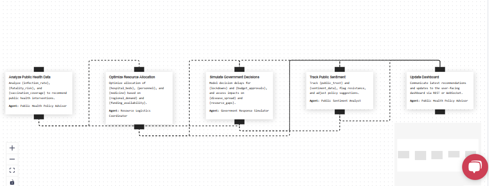
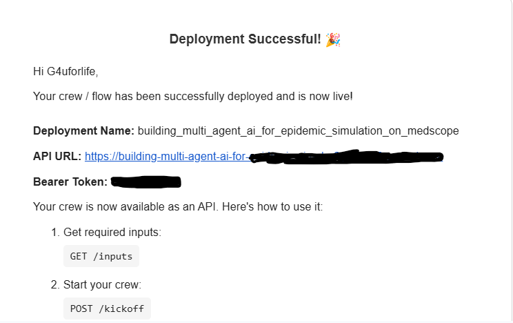
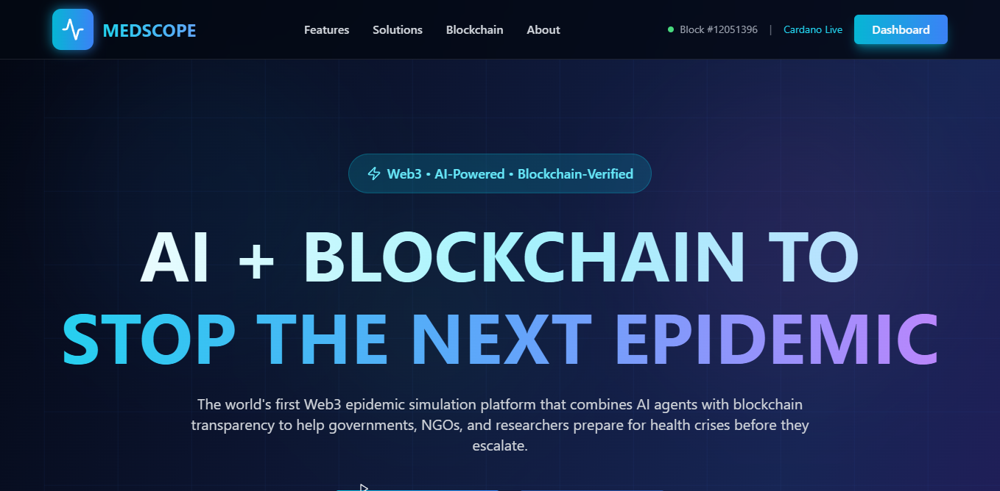
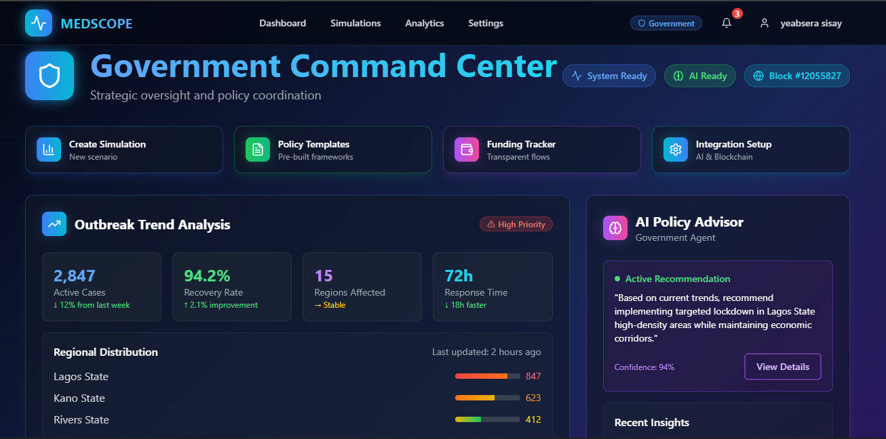

# 🩺 Medscope — Africa-Focused Epidemic Simulation & AI-Powered Health Response System

**Medscope** is a decentralized simulation and planning platform tailored for **African public health systems**. Powered by **CrewAI**'s intelligent agents and **Masumi**'s Cardano-based blockchain protocols, Medscope enables health institutions, NGOs, and policymakers to **simulate outbreaks, coordinate responses, and transparently manage funds**.

Built for the **African Blockchain Championship 2025**, Medscope addresses urgent gaps in **epidemic preparedness, funding transparency**, and **infrastructure resilience** — with a bold, local-first approach.

🔗 **Live Demo**: [https://medscop.vercel.app](medscope.vercel.app)

---

## 🌍 Africa’s Public Health Crisis

Africa accounts for **over 30% of global disease outbreaks**, yet:

- 🔴 Most countries **lack real-time epidemic forecasting tools**
- 🔴 Health funding is often **opaque and delayed**
- 🔴 Crisis response is **centralized**, slow, and under-documented

Medscope provides a **simulation-driven, AI-coordinated**, and **blockchain-verified** solution to change this narrative.

---

## 💡 Our Solution

A **smart outbreak planning platform** that helps African governments and NGOs:

- 🧠 Coordinate AI-driven health agents for response
- 🧪 Simulate epidemics like Ebola, Cholera, COVID-19
- 💳 Manage funding transparently via **Masumi testnet wallets**
- 📊 Make data-driven decisions based on real scenarios

---

## 🧠 How It Works

### 1. Outbreak Simulation  
Users select a disease and adjust critical parameters:  
- Transmission Rate  
- Vaccination Coverage  
- Population Density  
- Government Response Delay

### 2. CrewAI Agent Orchestration  
Medscope auto-generates agent workflows using:

- 👨‍⚕️ **Policy Advisor** – Recommends lockdowns, vaccines, protocols  
- 🚚 **Logistics Agent** – Distributes beds, staff, supplies  
- 📣 **Sentiment Agent** – Tracks public reaction  
- 🏛️ **Government Agent** – Simulates decision delays


### 3. Masumi Blockchain Integration  
All financial flows (demo ADA) are routed via agent wallets on **Cardano testnet** using **Masumi’s DID and identity registry**. Every decision is **logged immutably** to simulate public accountability.

---

## 🔗 Sponsor Technology: Masumi Blockchain

We use **Masumi’s open DID framework** to:

- Issue agent-specific IDs & wallets (NGOs, hospitals, gov)
- Simulate funding transfer in **test ADA**
- Log outbreak-related decisions for transparency
- Retrieve balances, histories, and simulate blockchain events

> This integration reflects **Masumi’s vision** for decentralized identity, transparency, and equitable funding access — making it perfect for African public health.

---

## 🧪 Key Features

| Feature                        | Description                                                            |
| ----------------------------- | ---------------------------------------------------------------------- |
| 🌍 African Epidemic Simulator | COVID-19, Ebola, Malaria, Cholera outbreak logic with parameter tuning |
| 🧠 CrewAI Agent System         | Agents simulate coordinated crisis response                           |
| 💸 Masumi Funding Dashboard   | Track test ADA flows per role and log decisions on-chain (simulated)   |
| 📊 Real-World Health Data     | WHO, CDC, India & NHS datasets integrated                             |
| 📈 Multi-role Dashboards      | Tailored interfaces for hospitals, NGOs, governments, researchers      |

---

## 🖥️ Screenshots





---

## ⚙️ Tech Stack

| Layer      | Tools                                                 |
| ---------- | ----------------------------------------------------- |
| Frontend   | Next.js, TypeScript, Tailwind CSS                     |
| Backend    | Node.js, Express, PostgreSQL, Prisma                  |
| Blockchain | Masumi (Cardano Testnet), Blockfrost SDK              |
| AI Agents  | CrewAI, LangChain, Gemini                             |
| Visualization | Leaflet, Chart.js, React Flow                     |
| Auth       | Supabase                                              |

---

## 🚀 Local Dev Setup

```bash
git clone https://github.com/yab-g4u/medscope.git
cd medscope
cp .env.example .env
npm install && cd frontend && npm install && cd ..
npx prisma db push
npm run dev
````

---

## 💸 Blockchain Simulation with Masumi

Roles with test wallets:

* 🏛️ Government
* 🏥 Hospital
* 🎓 Researcher
* 🏥 NGO

> All ADA is on **Cardano Preprod Testnet** for **safe simulation**.
> Simulate emergency disbursement, log decision metadata, and validate balance checks.

---

## 🧠 AI Agent Crew

| Agent      | Role                                                               |
| ---------- | ------------------------------------------------------------------ |
| Policy     | Predicts outcomes of lockdowns, testing, vaccine distribution      |
| Logistics  | Allocates beds, medicine, personnel based on outbreak stage        |
| Government | Simulates delayed decision impact                                  |
| Sentiment  | Evaluates public trust (simulated) based on response effectiveness |

Agents are defined in YAML and managed via `CrewAI`’s crew orchestration logic.

---

## 📡 Data Sources

* World Health Organization (WHO)
* CDC FluView + Cholera data
* India’s COVID Hospital APIs
* NHS UK Emergency Response Datasets

---

## 🔐 Security & Ethics

* 🚫 No real ADA used — only **preprod testnet**
* 🛡️ Wallet secrets never committed
* ✅ Ethical simulation only — not a trading platform

---

## 🛣️ Roadmap

* ✅ MVP Completed with agents + Masumi
* ✅ Testnet wallet flows for role-based simulation
* ✅ Frontend dashboards for all roles
* ⏳ CSV upload prediction models
* ⏳ Agent-to-agent protocol upgrade (for real-time logic chains)
* ⏳ Exportable analytics report

---

## 🧑🏾‍🤝‍🧑🏾 Built By Africans, For Africa

| Name            | Role                |
| -----------     | ------------------- |
| Yeabsera Sisay. | Product & Code Lead |

---

> Medscope is a bold step toward **autonomous epidemic preparedness** in Africa.
> Open. Transparent. AI-Driven. Blockchain-secured.
> Powered by vision — built by Africans for the world. 🌍


